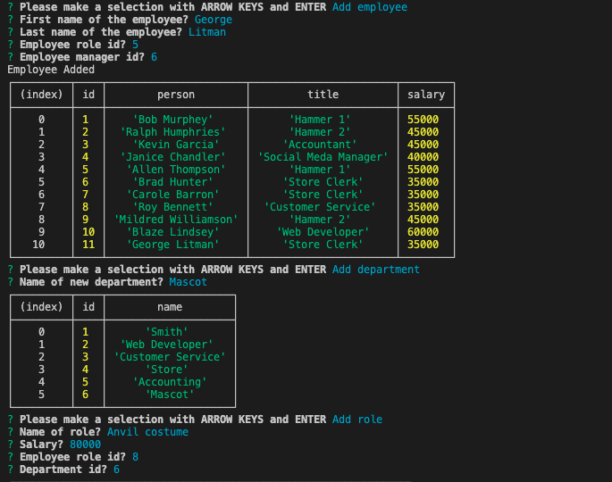

# Employee Log

Demo link: (https://youtu.be/JBuBGu_lc90)

## Description

This tool allows businesses to create an employee database. It also includes functions to add new employees, add new departments, and new roles. Allowing for businesses to easily keep a roster of their employees on hand.

## Installation

    run schema.sql file in mysql workbench & run "npm install" and "node index.js" in terminal 

## Built With

* [node.js](https://nodejs.org/en/)

* [inquirer](https://www.npmjs.com/package/inquirer)

* [javascript](https://developer.mozilla.org/en-US/docs/Web/javascript)

## Usage Instructions

    Once the application starts running you'll be greeted by the main menu where you can use the arrow keys and enter key to select options based upon your task. The software will then ask the user questions depending on the chosen option.

## Contributers

William Farnsworth - [Github](https://github.com/Cynwise)
